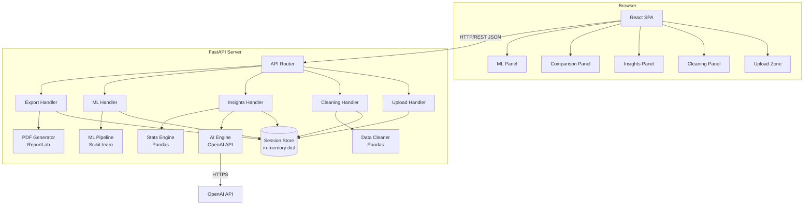
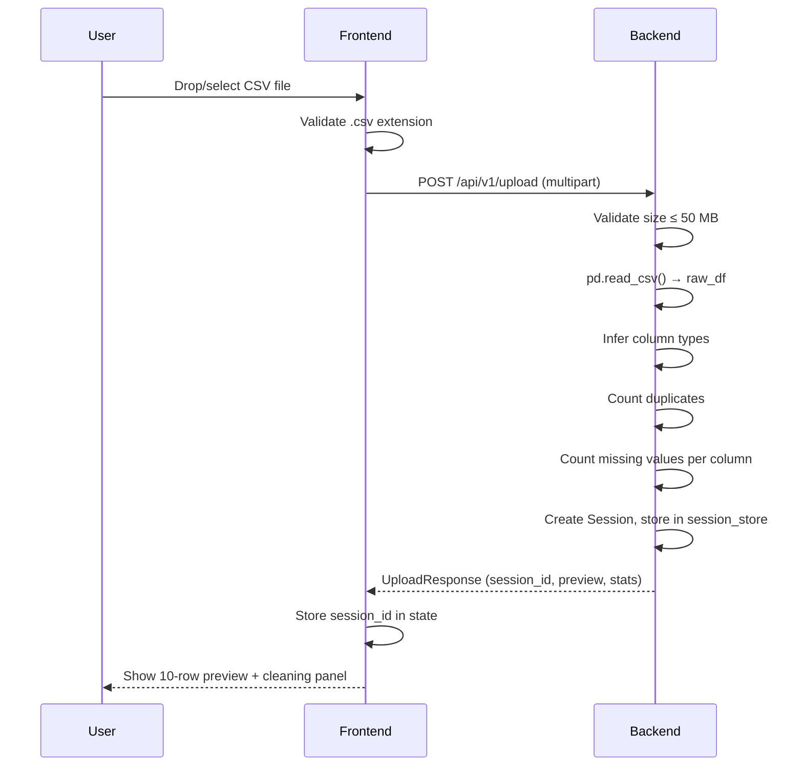
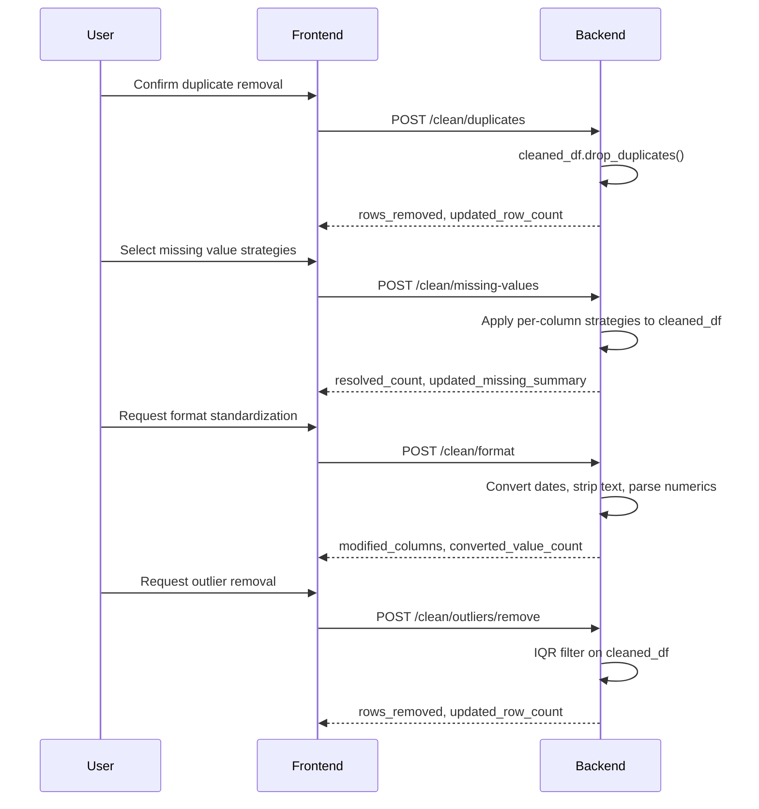
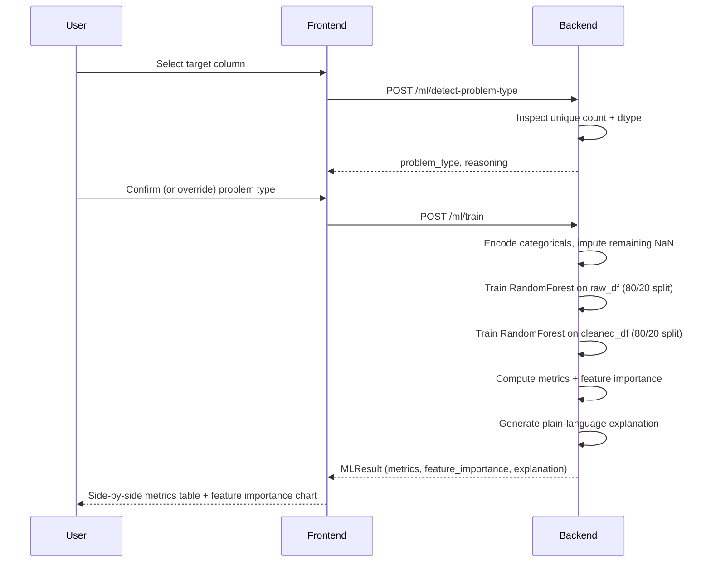

# Design Document: AI CSV Analyzer

## Overview

The AI CSV Analyzer is a full-stack web application that lets users upload CSV files and receive automated data cleaning, statistical analysis, AI-generated insights, and machine learning model comparisons — all through a browser-based dashboard.

The system is split into two tiers:

- **Frontend**: A React + TypeScript single-page application (SPA) that handles file upload, user interactions, chart rendering (Plotly.js), and result display.
- **Backend**: A Python FastAPI server that owns all data processing, AI/LLM calls, ML training, and file export.

Sessions are stored in-memory on the server, keyed by a UUID session identifier returned at upload time. Each session holds the raw dataset, the evolving cleaned dataset, and all derived results (statistics, insights, ML results).

### Key Design Decisions

| Decision | Choice | Rationale |
|---|---|---|
| Backend framework | FastAPI | Async support, automatic OpenAPI docs, Pydantic validation |
| Data processing | Pandas | Industry standard for tabular data; rich dtype inference and cleaning APIs |
| ML library | Scikit-learn | Random Forest, feature importance, and train/test split all built-in |
| AI/LLM | OpenAI API (gpt-4o-mini) | Cost-effective, reliable, structured output support |
| PDF generation | ReportLab | Pure-Python, no external dependencies |
| Frontend charts | Plotly.js | Interactive, supports bar/pie/scatter, React wrapper available |
| Session storage | In-memory dict | Simplest approach for single-server deployment; no DB dependency |
| Styling | Tailwind CSS | Utility-first, responsive breakpoints built-in |

---

## Architecture

### High-Level Component Diagram



### Request/Response Flow

All communication between the Frontend and Backend uses JSON over HTTP REST. File uploads use `multipart/form-data`. File downloads use streaming responses with appropriate `Content-Disposition` headers.

---

## Components and Interfaces

### Frontend Components

```
src/
├── App.tsx                        # Root component, session state, routing
├── components/
│   ├── upload/
│   │   ├── UploadZone.tsx         # Drag-and-drop + file picker
│   │   └── DataPreviewTable.tsx   # First-10-rows preview
│   ├── cleaning/
│   │   ├── CleaningPanel.tsx      # Orchestrates all cleaning steps
│   │   ├── DuplicateCard.tsx      # Duplicate count + confirm removal
│   │   ├── MissingValueCard.tsx   # Per-column missing value controls
│   │   ├── FormatCard.tsx         # Standardization options
│   │   └── OutlierCard.tsx        # Outlier highlight + removal
│   ├── insights/
│   │   ├── InsightsPanel.tsx      # AI insights display
│   │   └── SummaryStatsTable.tsx  # Per-column statistics table
│   ├── comparison/
│   │   ├── ComparisonPanel.tsx    # Side-by-side raw vs cleaned
│   │   ├── MetricsSummary.tsx     # Rows removed, duplicates, etc.
│   │   └── ComparisonCharts.tsx   # Bar + pie charts
│   ├── ml/
│   │   ├── MLPanel.tsx            # ML workflow orchestration
│   │   ├── TargetColumnSelector.tsx
│   │   ├── ProblemTypeDisplay.tsx
│   │   ├── ModelMetricsTable.tsx  # Side-by-side metrics comparison
│   │   └── FeatureImportanceChart.tsx
│   └── shared/
│       ├── LoadingSpinner.tsx
│       ├── ErrorBanner.tsx
│       └── DownloadButton.tsx
├── hooks/
│   ├── useSession.ts              # Session ID management
│   └── useApi.ts                  # Typed fetch wrapper with loading state
├── types/
│   └── api.ts                     # TypeScript types mirroring API schemas
└── api/
    └── client.ts                  # All API call functions
```

### Backend Modules

```
app/
├── main.py                        # FastAPI app, CORS, router registration
├── routers/
│   ├── upload.py                  # POST /upload
│   ├── cleaning.py                # POST /sessions/{id}/clean/*
│   ├── insights.py                # POST /sessions/{id}/insights
│   ├── stats.py                   # GET  /sessions/{id}/stats
│   ├── ml.py                      # POST /sessions/{id}/ml/*
│   └── export.py                  # GET  /sessions/{id}/export/*
├── services/
│   ├── session_store.py           # In-memory session dict + CRUD
│   ├── data_cleaner.py            # Duplicate, missing, format, outlier logic
│   ├── stats_engine.py            # Summary statistics computation
│   ├── ai_engine.py               # OpenAI API calls + prompt templates
│   ├── ml_pipeline.py             # Problem type detection + model training
│   └── pdf_generator.py           # ReportLab PDF assembly
├── models/
│   └── schemas.py                 # Pydantic request/response models
└── config.py                      # Environment variables (API keys, limits)
```

---

## API Design

All endpoints are prefixed with `/api/v1`. Error responses follow the shape `{"detail": "<message>"}`.

### Upload

#### `POST /api/v1/upload`

Upload a CSV file and create a session.

**Request**: `multipart/form-data`
- `file`: CSV file (max 50 MB)

**Response `200`**:
```json
{
  "session_id": "uuid-string",
  "filename": "data.csv",
  "row_count": 1500,
  "column_count": 12,
  "columns": ["col1", "col2", "..."],
  "preview": [
    {"col1": "val", "col2": "val"},
    "... (10 rows)"
  ],
  "duplicate_count": 42,
  "missing_value_summary": {
    "col1": {"count": 5, "percentage": 0.33},
    "col2": {"count": 0, "percentage": 0.0}
  },
  "inferred_types": {
    "col1": "numeric",
    "col2": "date",
    "col3": "text"
  }
}
```

**Errors**: `400` (not CSV, malformed CSV), `413` (file too large)

---

### Cleaning

#### `POST /api/v1/sessions/{session_id}/clean/duplicates`

Remove duplicate records.

**Request**: `{}`  (empty body — user confirmation implied by calling endpoint)

**Response `200`**:
```json
{
  "rows_removed": 42,
  "updated_row_count": 1458
}
```

---

#### `POST /api/v1/sessions/{session_id}/clean/missing-values`

Apply missing value strategy to one or more columns.

**Request**:
```json
{
  "strategies": [
    {"column": "age", "method": "mean"},
    {"column": "city", "method": "mode"},
    {"column": "notes", "method": "drop_rows"},
    {"column": "price", "method": "fill", "fill_value": "0"}
  ]
}
```

**Response `200`**:
```json
{
  "resolved_count": 87,
  "updated_missing_summary": {
    "age": {"count": 0, "percentage": 0.0},
    "city": {"count": 0, "percentage": 0.0}
  }
}
```

---

#### `POST /api/v1/sessions/{session_id}/clean/missing-values/suggest`

Get AI-suggested fill strategy for a column.

**Request**:
```json
{"column": "age"}
```

**Response `200`**:
```json
{
  "column": "age",
  "suggested_method": "mean",
  "rationale": "The column is numeric with a roughly normal distribution; mean imputation minimizes distortion."
}
```

---

#### `POST /api/v1/sessions/{session_id}/clean/format`

Standardize column formats.

**Request**:
```json
{
  "columns": [
    {"column": "signup_date", "type": "date"},
    {"column": "name", "type": "text", "casing": "title"},
    {"column": "revenue", "type": "numeric"}
  ]
}
```

**Response `200`**:
```json
{
  "modified_columns": ["signup_date", "name", "revenue"],
  "converted_value_count": 312,
  "new_missing_count": 3
}
```

---

#### `POST /api/v1/sessions/{session_id}/clean/outliers/detect`

Detect outliers using IQR.

**Response `200`**:
```json
{
  "outlier_summary": {
    "revenue": {
      "count": 14,
      "lower_bound": -500.0,
      "upper_bound": 9500.0
    },
    "age": {
      "count": 2,
      "lower_bound": 5.0,
      "upper_bound": 85.0
    }
  },
  "outlier_row_indices": [12, 45, 99, "..."]
}
```

---

#### `POST /api/v1/sessions/{session_id}/clean/outliers/remove`

Remove rows containing outliers.

**Response `200`**:
```json
{
  "rows_removed": 16,
  "updated_row_count": 1442
}
```

---

### Statistics

#### `GET /api/v1/sessions/{session_id}/stats`

Get summary statistics for both raw and cleaned datasets.

**Response `200`**:
```json
{
  "raw": {
    "col1": {"type": "numeric", "count": 1500, "mean": 42.3, "median": 41.0, "std": 8.1, "min": 18.0, "max": 95.0, "p25": 36.0, "p75": 48.0},
    "col2": {"type": "text", "count": 1500, "unique": 45, "top": "New York", "top_freq": 312}
  },
  "cleaned": { "...same shape..." }
}
```

---

### Insights

#### `POST /api/v1/sessions/{session_id}/insights`

Generate AI insights (async, may take up to 30 seconds).

**Response `200`**:
```json
{
  "summary": "Your dataset contains 1,442 rows across 12 columns...",
  "top_correlations": [
    {"col_a": "age", "col_b": "revenue", "correlation": 0.72, "description": "Age and revenue are strongly positively correlated."}
  ],
  "temporal_trends": "Revenue shows a consistent upward trend from Q1 to Q4.",
  "quality_suggestions": [
    "Consider removing the 'notes' column — it has 60% missing values.",
    "The 'country' column has 3 inconsistent spellings of 'United States'.",
    "Revenue outliers above $9,500 may represent data entry errors."
  ]
}
```

---

### Machine Learning

#### `POST /api/v1/sessions/{session_id}/ml/detect-problem-type`

Detect classification vs. regression from target column.

**Request**:
```json
{"target_column": "churn"}
```

**Response `200`**:
```json
{
  "target_column": "churn",
  "problem_type": "classification",
  "unique_value_count": 2,
  "reasoning": "Target column has 2 unique values and is of text type."
}
```

---

#### `POST /api/v1/sessions/{session_id}/ml/train`

Train models on raw and cleaned datasets.

**Request**:
```json
{
  "target_column": "churn",
  "problem_type": "classification"
}
```

**Response `200`** (classification):
```json
{
  "problem_type": "classification",
  "raw_model_metrics": {
    "accuracy": 0.81,
    "precision": 0.79,
    "recall": 0.76,
    "f1": 0.77
  },
  "cleaned_model_metrics": {
    "accuracy": 0.88,
    "precision": 0.86,
    "recall": 0.84,
    "f1": 0.85
  },
  "better_model": "cleaned",
  "explanation": "The cleaned dataset model outperforms the raw model across all metrics, likely because removing 42 duplicate records and imputing missing values reduced noise in the training data.",
  "feature_importance": [
    {"feature": "age", "score": 0.31},
    {"feature": "revenue", "score": 0.24},
    "..."
  ],
  "top_features_description": "Age is the strongest predictor (31% importance), suggesting older customers churn at different rates. Revenue follows closely at 24%, indicating spend level is a key retention signal."
}
```

**Response `200`** (regression):
```json
{
  "problem_type": "regression",
  "raw_model_metrics": {"rmse": 1240.5, "mae": 890.2, "r2": 0.71},
  "cleaned_model_metrics": {"rmse": 980.1, "mae": 710.4, "r2": 0.83},
  "better_model": "cleaned",
  "explanation": "...",
  "feature_importance": ["..."],
  "top_features_description": "..."
}
```

---

### Export

#### `GET /api/v1/sessions/{session_id}/export/csv`

Download the cleaned dataset as CSV.

**Response**: `text/csv` file stream, `Content-Disposition: attachment; filename="cleaned_<original>.csv"`

---

#### `GET /api/v1/sessions/{session_id}/export/report`

Download the insights report as PDF.

**Response**: `application/pdf` file stream, `Content-Disposition: attachment; filename="insights_report_<original>.pdf"`

---

## Data Models

### Session (server-side, not serialized to client)

```python
@dataclass
class Session:
    session_id: str                    # UUID
    filename: str                      # Original filename
    raw_df: pd.DataFrame               # Immutable raw dataset
    cleaned_df: pd.DataFrame           # Mutable cleaned dataset (starts as copy of raw)
    inferred_types: dict[str, str]     # column -> "numeric" | "date" | "text"
    
    # Cleaning audit trail
    duplicates_removed: int = 0
    missing_resolved: int = 0
    outliers_removed: int = 0
    columns_standardized: list[str] = field(default_factory=list)
    
    # Derived results (populated lazily)
    insights: InsightResult | None = None
    ml_result: MLResult | None = None
    
    created_at: datetime = field(default_factory=datetime.utcnow)
```

### Pydantic API Schemas

```python
# --- Upload ---
class UploadResponse(BaseModel):
    session_id: str
    filename: str
    row_count: int
    column_count: int
    columns: list[str]
    preview: list[dict[str, Any]]
    duplicate_count: int
    missing_value_summary: dict[str, MissingValueInfo]
    inferred_types: dict[str, str]

class MissingValueInfo(BaseModel):
    count: int
    percentage: float

# --- Cleaning ---
class MissingValueStrategy(BaseModel):
    column: str
    method: Literal["mean", "median", "mode", "forward_fill", "drop_rows", "fill"]
    fill_value: str | None = None

class ApplyMissingValueRequest(BaseModel):
    strategies: list[MissingValueStrategy]

class FormatColumnRequest(BaseModel):
    column: str
    type: Literal["date", "numeric", "text"]
    casing: Literal["lower", "upper", "title"] | None = None

class ApplyFormatRequest(BaseModel):
    columns: list[FormatColumnRequest]

# --- Statistics ---
class NumericColumnStats(BaseModel):
    type: Literal["numeric"]
    count: int
    mean: float
    median: float
    std: float
    min: float
    max: float
    p25: float
    p75: float

class TextColumnStats(BaseModel):
    type: Literal["text"]
    count: int
    unique: int
    top: str
    top_freq: int

# --- Insights ---
class CorrelationEntry(BaseModel):
    col_a: str
    col_b: str
    correlation: float
    description: str

class InsightResult(BaseModel):
    summary: str
    top_correlations: list[CorrelationEntry]
    temporal_trends: str | None
    quality_suggestions: list[str]

# --- ML ---
class ClassificationMetrics(BaseModel):
    accuracy: float
    precision: float
    recall: float
    f1: float

class RegressionMetrics(BaseModel):
    rmse: float
    mae: float
    r2: float

class FeatureImportanceEntry(BaseModel):
    feature: str
    score: float

class MLResult(BaseModel):
    problem_type: Literal["classification", "regression"]
    raw_model_metrics: ClassificationMetrics | RegressionMetrics
    cleaned_model_metrics: ClassificationMetrics | RegressionMetrics
    better_model: Literal["raw", "cleaned", "tie"]
    explanation: str
    feature_importance: list[FeatureImportanceEntry]
    top_features_description: str
```

---

## Data Flow Diagrams

### Upload and Session Creation



### Cleaning Pipeline



### ML Training Flow



---

## Correctness Properties

*A property is a characteristic or behavior that should hold true across all valid executions of a system — essentially, a formal statement about what the system should do. Properties serve as the bridge between human-readable specifications and machine-verifiable correctness guarantees.*


### Property 1: Non-CSV files are rejected

*For any* filename whose extension is not `.csv`, the frontend validation SHALL reject the file and display an error message without initiating an upload.

**Validates: Requirements 1.3**

---

### Property 2: Upload creates a session with correct data

*For any* valid CSV file with N rows and M columns, uploading it SHALL return a session identifier, and the session's raw dataset SHALL contain exactly N rows and M columns with the same values as the original file.

**Validates: Requirements 1.7**

---

### Property 3: Preview shows at most 10 rows

*For any* valid CSV file with N rows, the upload response preview SHALL contain exactly `min(N, 10)` rows, and those rows SHALL be the first `min(N, 10)` rows of the dataset.

**Validates: Requirements 1.8**

---

### Property 4: File size limit is enforced

*For any* file whose size exceeds 50 MB, the backend SHALL return an error response and SHALL NOT create a session. *For any* file whose size is at or below 50 MB and is a valid CSV, the backend SHALL succeed.

**Validates: Requirements 1.5**

---

### Property 5: Malformed CSV produces an error

*For any* byte sequence that is not a valid CSV (mismatched column counts, invalid encoding, etc.), the backend SHALL return an error response and SHALL NOT create a session.

**Validates: Requirements 1.6**

---

### Property 6: Duplicate detection is accurate

*For any* DataFrame with a known number of duplicate rows D, the backend's duplicate scan SHALL report exactly D duplicates — no more, no fewer.

**Validates: Requirements 2.1, 2.2**

---

### Property 7: Duplicate removal preserves first occurrences and updates row count

*For any* DataFrame with R total rows and D duplicate rows, after duplicate removal: (a) the cleaned dataset contains zero duplicate rows, (b) every unique row from the original is present, (c) the returned `updated_row_count` equals R − D.

**Validates: Requirements 2.3, 2.4**

---

### Property 8: Missing value counts are accurate

*For any* DataFrame with a known missing value pattern, the backend's missing value scan SHALL report the exact count and correct percentage for each column, where `percentage = count / total_rows * 100`.

**Validates: Requirements 3.1**

---

### Property 9: Missing value strategies reduce missing counts

*For any* column with M missing values and any valid fill strategy (mean, median, mode, forward_fill), after applying the strategy the missing count for that column SHALL be 0. For the `drop_rows` strategy, the missing count SHALL be 0 and the row count SHALL decrease by the number of rows that had missing values in that column.

**Validates: Requirements 3.4, 3.5**

---

### Property 10: AI-suggested fill strategy is always a valid strategy

*For any* column with missing values, the AI-suggested fill strategy SHALL be one of: `mean`, `median`, `mode`, `forward_fill`, `drop_rows`.

**Validates: Requirements 3.3**

---

### Property 11: Format standardization transforms values correctly

*For any* date string in a recognized format, standardization SHALL produce a string matching `YYYY-MM-DD`. *For any* text string, standardization SHALL produce a string with no leading/trailing whitespace and casing matching the requested style. *For any* numeric string containing currency symbols or thousand separators, standardization SHALL produce the equivalent numeric value.

**Validates: Requirements 4.3, 4.4, 4.5**

---

### Property 12: Unconvertible values become missing values

*For any* value in a column that cannot be converted to the inferred type, after standardization that cell SHALL be marked as a missing value (NaN), and the missing value count for that column SHALL increase by 1.

**Validates: Requirements 4.6**

---

### Property 13: IQR outlier detection identifies correct values

*For any* numeric column, the IQR outlier detection SHALL identify exactly the values outside the range `[Q1 − 1.5 × IQR, Q3 + 1.5 × IQR]`, and the returned `lower_bound` and `upper_bound` SHALL equal those thresholds.

**Validates: Requirements 5.1, 5.2**

---

### Property 14: Outlier removal eliminates all outlier rows

*For any* DataFrame with known outlier rows, after outlier removal: (a) no row in the cleaned dataset contains a value outside the IQR bounds for any numeric column, (b) the returned `rows_removed` equals the number of rows that contained at least one outlier value.

**Validates: Requirements 5.5**

---

### Property 15: Top correlations are correctly ranked

*For any* DataFrame with numeric columns, the top-5 correlations returned by the backend SHALL be the 5 column pairs with the highest absolute Pearson correlation coefficients, ranked in descending order of absolute value.

**Validates: Requirements 6.2**

---

### Property 16: At least 3 quality suggestions are always returned

*For any* dataset, the AI insights response SHALL contain a `quality_suggestions` list with at least 3 entries.

**Validates: Requirements 6.4**

---

### Property 17: Numeric summary statistics are correct

*For any* numeric column in a DataFrame, the computed statistics SHALL satisfy: `min ≤ p25 ≤ median ≤ p75 ≤ max`, `mean` equals the arithmetic mean of non-null values, and `std` equals the standard deviation of non-null values.

**Validates: Requirements 7.1**

---

### Property 18: Problem type detection follows the specified rules

*For any* target column, the detected problem type SHALL be `classification` if the column has ≤ 10 unique values or is of text type, and SHALL be `regression` if the column has > 10 unique values and is of numeric type.

**Validates: Requirements 9.2, 9.3, 9.4**

---

### Property 19: Train/test split is 80/20

*For any* dataset with N rows used for ML training, the training set SHALL contain `floor(0.8 × N)` rows and the test set SHALL contain the remaining rows, with no overlap between the two sets.

**Validates: Requirements 10.1**

---

### Property 20: Classification metrics are valid probabilities

*For any* classification training run, all four reported metrics (accuracy, precision, recall, F1-score) SHALL be in the range `[0.0, 1.0]`.

**Validates: Requirements 10.2**

---

### Property 21: Regression metrics satisfy validity constraints

*For any* regression training run, RMSE and MAE SHALL be ≥ 0, and R² SHALL be ≤ 1.0.

**Validates: Requirements 10.3**

---

### Property 22: Better model highlighting is consistent

*For any* pair of model metric results, the metric value highlighted as "better" SHALL be the higher value for accuracy, precision, recall, F1, and R², and the lower value for RMSE and MAE.

**Validates: Requirements 10.6**

---

### Property 23: Feature importance scores sum to approximately 1

*For any* trained Random Forest model, the sum of all feature importance scores SHALL be within 0.001 of 1.0.

**Validates: Requirements 11.1**

---

### Property 24: Feature importance scores are sorted descending

*For any* feature importance result, the scores SHALL be in non-increasing order (each score ≤ the previous score).

**Validates: Requirements 11.2**

---

### Property 25: Feature importance chart shows top features

*For any* feature importance list with F total features, the chart SHALL display exactly `min(F, 10)` features, and those features SHALL be the ones with the highest scores.

**Validates: Requirements 11.3**

---

### Property 26: CSV export is a round-trip

*For any* cleaned DataFrame, serializing it to CSV and then parsing the CSV back SHALL produce a DataFrame with the same shape, column names, and values (within floating-point tolerance for numeric columns).

**Validates: Requirements 12.2**

---

### Property 27: Export filenames follow the specified patterns

*For any* original filename `F`, the cleaned CSV download filename SHALL be `cleaned_F` and the PDF report filename SHALL be `insights_report_F`.

**Validates: Requirements 12.2, 12.5**

---

### Property 28: Loading indicator appears for slow operations

*For any* backend operation whose response takes longer than 500ms, the frontend SHALL display a loading indicator before the response arrives and hide it after the response is received.

**Validates: Requirements 13.4**

---

### Property 29: All interactive elements have aria-labels

*For any* interactive element rendered by the frontend (buttons, inputs, charts, dropdowns), the element SHALL have a non-empty `aria-label` attribute.

**Validates: Requirements 13.6**

---

## Error Handling

### Backend Error Strategy

All errors are returned as JSON with HTTP status codes and a `detail` field:

```python
# FastAPI exception handler
@app.exception_handler(AppError)
async def app_error_handler(request, exc):
    return JSONResponse(
        status_code=exc.status_code,
        content={"detail": exc.message}
    )
```

| Scenario | HTTP Status | Detail Message |
|---|---|---|
| Non-CSV file uploaded | 400 | "Only .csv files are accepted." |
| File exceeds 50 MB | 413 | "File size exceeds the 50 MB limit." |
| Malformed CSV | 400 | "CSV parsing failed: {pandas error message}" |
| Session not found | 404 | "Session '{id}' not found or has expired." |
| Column not found in dataset | 400 | "Column '{name}' does not exist in the dataset." |
| Invalid fill strategy | 422 | Pydantic validation error |
| OpenAI API failure | 502 | "AI service is temporarily unavailable. Please try again." |
| ML training timeout | 504 | "Model training exceeded the 120-second time limit." |
| PDF generation failure | 500 | "Failed to generate the insights report." |

### Frontend Error Strategy

- All API calls go through `useApi.ts`, which catches errors and sets an `error` state.
- `ErrorBanner` component renders at the top of the relevant panel when `error` is non-null.
- Errors are dismissible and do not block the rest of the UI.
- File validation errors (non-CSV, size) are caught client-side before the upload request is made.

### Session Lifecycle

- Sessions are created on upload and stored in a server-side dictionary.
- Sessions are not automatically expired in the MVP (in-memory, single-server).
- If the server restarts, all sessions are lost; the user must re-upload.
- Future work: add TTL-based expiry and optional Redis-backed session store.

---

## Testing Strategy

### Dual Testing Approach

The testing strategy combines unit/example-based tests for specific behaviors with property-based tests for universal correctness guarantees.

### Property-Based Testing

The feature involves substantial pure-function logic in the backend (data cleaning, statistics, ML pipeline) that is well-suited for property-based testing. The chosen library is **Hypothesis** (Python), which integrates naturally with pytest and provides rich data generators for DataFrames via the `hypothesis-pandas` extension.

Each property test is configured to run a minimum of 100 iterations. Tests are tagged with a comment referencing the design property they validate.

**Tag format**: `# Feature: ai-csv-analyzer, Property {N}: {property_text}`

**Example property test structure**:

```python
from hypothesis import given, settings
from hypothesis import strategies as st
from hypothesis.extra.pandas import column, data_frames

# Feature: ai-csv-analyzer, Property 6: Duplicate detection is accurate
@given(data_frames(
    columns=[column("a", dtype=int), column("b", dtype=str)],
    rows=st.integers(min_value=0, max_value=500)
))
@settings(max_examples=100)
def test_duplicate_detection_accuracy(df):
    expected_duplicates = df.duplicated().sum()
    result = detect_duplicates(df)
    assert result["duplicate_count"] == expected_duplicates
```

### Unit / Example-Based Tests

Unit tests cover:
- Specific error conditions (malformed CSV, oversized file, missing session)
- UI component rendering (upload zone, metrics summary, comparison panels)
- Conditional rendering (download button appears only when cleaned dataset exists)
- API response shape validation

### Integration Tests

Integration tests cover:
- Full upload → clean → insights → ML → export workflow with a real CSV file
- OpenAI API integration (with a small dataset, verifying response structure)
- ML training performance (100,000-row dataset completes within 120 seconds)
- PDF generation produces a valid, non-empty PDF

### Frontend Testing

- **React Testing Library** for component unit tests and interaction tests
- **Vitest** as the test runner
- **axe-core** for automated WCAG 2.1 AA accessibility checks
- **Playwright** for end-to-end workflow tests

### Backend Testing

- **pytest** as the test runner
- **Hypothesis** for property-based tests
- **httpx** + **pytest-asyncio** for FastAPI endpoint tests
- **unittest.mock** / **pytest-mock** for mocking OpenAI API calls in unit tests

### Test Coverage Targets

| Layer | Target |
|---|---|
| Backend services (data_cleaner, stats_engine, ml_pipeline) | ≥ 90% line coverage |
| API endpoints | 100% of endpoints have at least one test |
| Frontend components | ≥ 80% line coverage |
| Property tests | All 29 correctness properties have a corresponding test |
